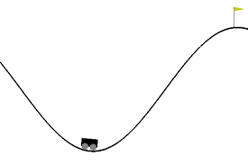

# Reinforcement Learning - Gym Sandbox

## Mountain Car Problem

https://gymnasium.farama.org/environments/classic_control/mountain_car/

## Temporal Difference Learning (TD Learning)

Bellman equation:

$$
Q_{k+1}(s,a)
$$

is the new Q_value of the considered state, the one to update
 

$$
Q_k(s,a)
$$

is the actual Q_value of the considered state

$$
max_{a'}Q_k(s', a')
$$

is the maximum of Q_value along its actions, of a chosen next state

## References

[L42 Project](https://github.com/L42Project/Tutoriels/tree/master/Divers/renforcement2)

and YouTube lessons: [here](https://youtube.com/playlist?list=PLALfJegMRGp3_H_eiOoxqkCEKnSsAf9cg)

[FarzamTP](https://github.com/FarzamTP/Q-Learning-Mountain-Car/tree/master)
